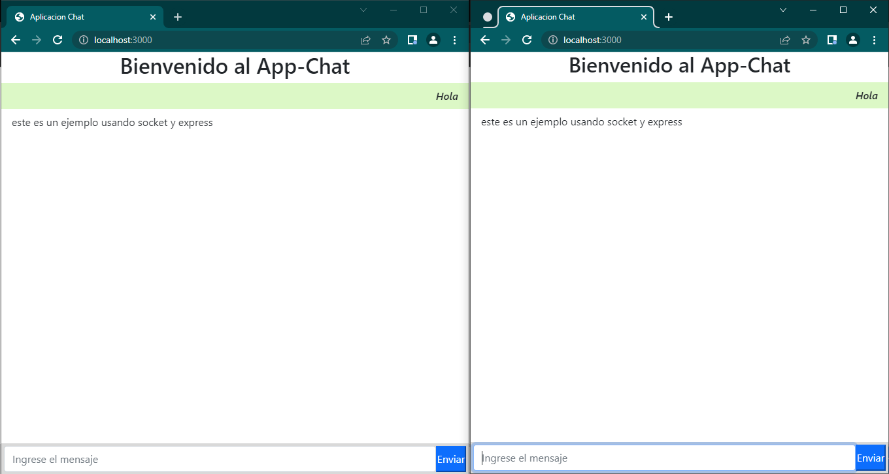

# Aplicacion Chat con Node.js - Socket.io

Servidor: **Node(express)** 
Cliente: **Socket.io** 

# Comandos:

## Proceso de creacion del Proyecto
Comando para crear el proyecto en la ruta establecida:
**`npm init -y`**
El comando creara el archivo **package.json**
 

### Requisitos: Instalacion de los siguientes paquetes

#### 1.Paquete Express
**`npm i express`**

#### 2.Paquete Nodemon
**`npm i nodemon`**

#### 3.Paquete Socket.io
**`npm i socket.io`**

## Funciones de los paquetes
### Express:
Se pueden realizar **peticiones mediante el protocolo HTTP** en diferentes URL (rutas).

### Nodemon:
Es una utilidad de interfaz de línea de comandos (CLI), su funcion es **vigilar el sistema de archivos y reiniciar automáticamente el proceso**.

### Socket.io:
Es una librería basada en el protocolo Websocket para Node.js que **permite una comunicación TCP bidireccional en tiempo real entre clientes y servidor**.

## Correr la Aplicacion
`nodemon app`

# Vista

    

